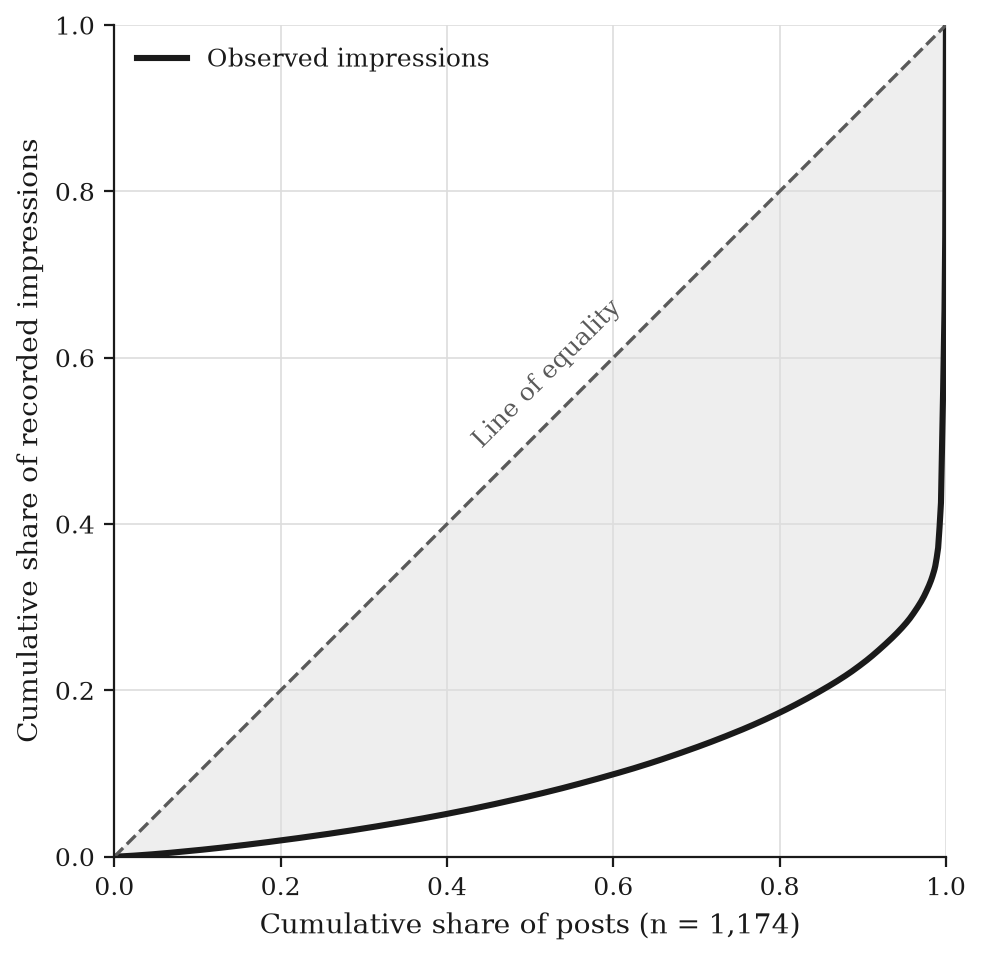
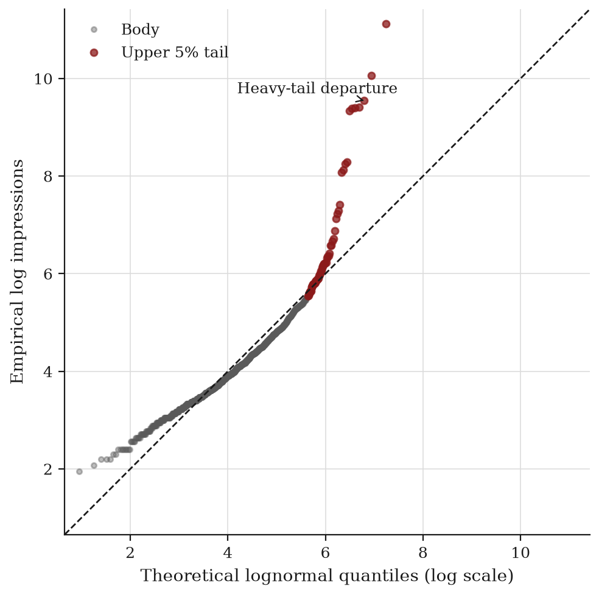
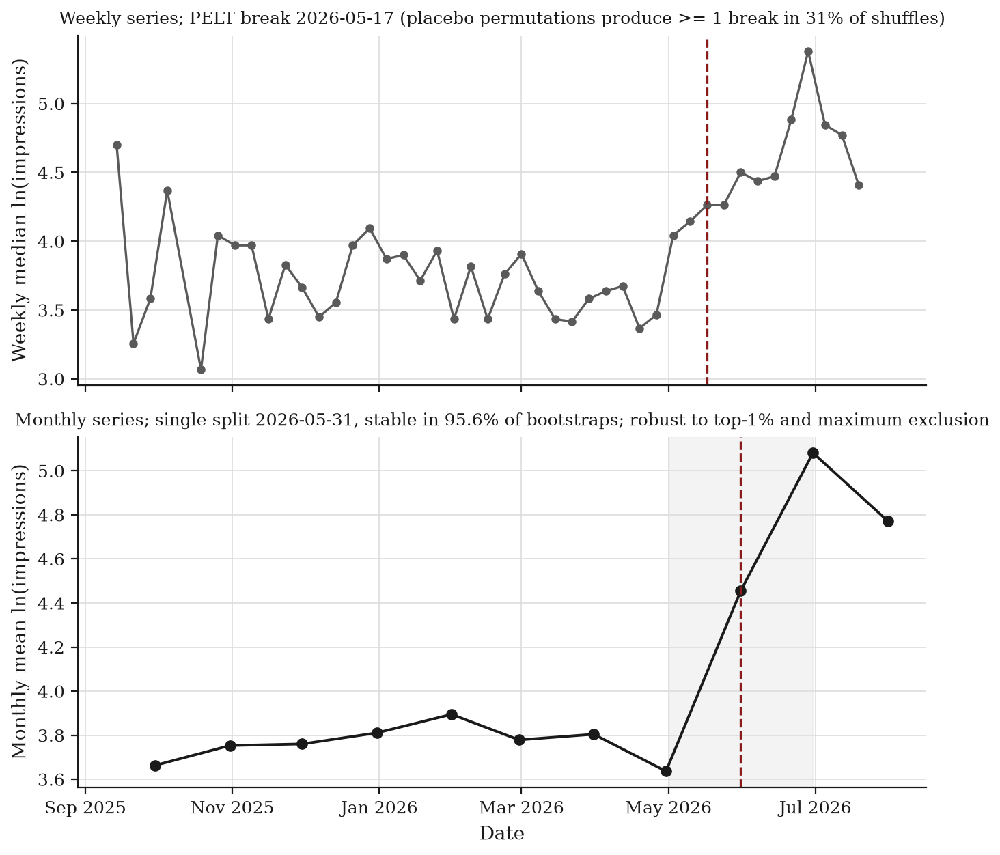
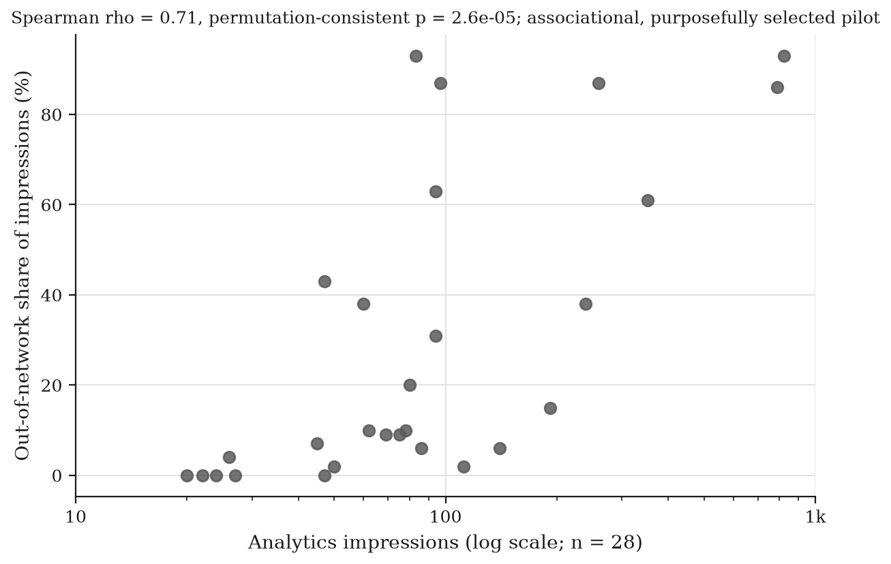

# FeedTrace

Independent, single-account research on observable LinkedIn recorded impressions, ranking behavior, audience expansion, impression concentration, and preliminary racial-visibility differences using creator-owned data.

Independent research. Not affiliated with, endorsed by, or conducted on behalf of LinkedIn or any employer.

**Status.** Preliminary preprint checkpoint. Race-related topic labels were produced by a deterministic keyword taxonomy and remain preliminary. The main account-level racial-visibility signal is **Unresolved**. This repository does not prove or disprove suppression.


## Start here

- [Research report (PDF)](paper/FeedTrace_Independent_Research_Report.pdf)
- [Technical supplement (PDF)](paper/FeedTrace_Technical_Supplement.pdf)
- [Reproduce the benchmark](docs/REPRODUCIBILITY.md)
- [Methodology](docs/METHODOLOGY.md)
- [Data availability](docs/DATA_AVAILABILITY.md)
- [Data dictionary](data/DATA_DICTIONARY.md)
- [Research integrity](docs/RESEARCH_INTEGRITY.md)
- [Limitations](docs/LIMITATIONS.md)
- [How to cite](CITATION.cff)
- [Contributing](CONTRIBUTING.md)

## Research at a glance

- 1,192 inventoried records: 1,174 creator-owned original posts and 18 reposts
- Study window: September 6, 2025 through July 18, 2026
- Feed-level recorded impressions for all 1,174 originals
- Detailed creator analytics for a purposefully selected 29-post pilot (members reached and out-of-network share for 28)
- 29 originals with verified full text; most remaining posts classified from possibly truncated previews
- Preliminary automated race labels; main racial-visibility signal Unresolved
- Single-account observational design

## Key findings

Each figure below is a rendered manuscript figure. Generation code for the figures is not part of the public package; see [Reproducibility](#reproducibility) for what can be rerun from public inputs.

### 1. Recorded impressions are extremely concentrated

A small number of posts capture most of the recorded impressions. The median original post received 53 recorded impressions, the top 1 percent of posts account for 63.5 percent of all impressions, and the bottom half account for 7.3 percent. The Gini coefficient is 0.799, equivalent to roughly 11.9 equally weighted posts.



Lorenz curve (paper Figure 4). The horizontal axis is the cumulative share of posts and the vertical axis is the cumulative share of recorded impressions; the dashed diagonal is perfect equality. Source data: [`data/aggregate/concentration/CONCENTRATION_BY_STRATUM.csv`](data/aggregate/concentration/CONCENTRATION_BY_STRATUM.csv) and [`data/sanitized/R9_SANITIZED_NON_RACE_ANALYTIC_DATA.csv`](data/sanitized/R9_SANITIZED_NON_RACE_ANALYTIC_DATA.csv). Paper section: [manuscript](paper/source/manuscript.md).

### 2. A heavy upper tail that no single distribution fits

Across candidate families, no tested continuous distribution fits both the body and the extreme upper tail. Model selection by corrected AIC ranks a Burr XII family best, but a lower AIC is only a relative ranking and does not certify that a model captures the tail. A fitted lognormal implies a theoretical 95th percentile near 167 recorded impressions, while the empirical upper tail runs substantially higher.



Lognormal Q-Q plot (paper Figure 6). Points on the dashed line would indicate a lognormal fit; the highlighted upper-tail points depart upward. Source data: [`data/sanitized/R9_SANITIZED_NON_RACE_ANALYTIC_DATA.csv`](data/sanitized/R9_SANITIZED_NON_RACE_ANALYTIC_DATA.csv). Distribution ranking: paper Figure 7 (`figures/rendered/fig07_distribution_comparison.png`). Paper section: [technical supplement](paper/source/technical_supplement.md).

### 3. A descriptive upward shift in mid-2026

A change-point analysis detects an upward shift in weekly median and monthly mean log impressions around mid-May 2026 (weekly PELT break dated 2026-05-17; monthly split 2026-05-31, stable in 95.6 percent of bootstraps). The unadjusted monthly level rose by roughly 2.74 times at the data-selected break, with a smaller adjusted post-level estimate. This is descriptive: the analysis does not identify a cause.



Change-point series (paper Figure 15). Top: weekly median log impressions with the detected break marked. Bottom: monthly mean log impressions with the selected split. Source data: [`data/aggregate/structural_breaks/STRUCTURAL_BREAK_SENSITIVITY.csv`](data/aggregate/structural_breaks/STRUCTURAL_BREAK_SENSITIVITY.csv). Paper section: [technical supplement](paper/source/technical_supplement.md).

### 4. Audience-expansion pilot (exploratory)

In the purposefully selected detailed-analytics pilot, posts with more impressions tended to reach a higher share of members outside the follower network (Spearman rho 0.71, permutation-consistent p = 2.6e-05, n = 28). This is an exploratory association in a small, non-representative pilot and is not evidence of a causal ranking mechanism.



Out-of-network share versus impressions (paper Figure 20). Horizontal axis is analytics impressions (log scale, n = 28); vertical axis is the out-of-network share of impressions. Source data are drawn from the private detailed-analytics pilot (Level B, withheld); see [Data availability](docs/DATA_AVAILABILITY.md). Paper section: [technical supplement](paper/source/technical_supplement.md).

## Racial-visibility status

The primary account-level racial-visibility signal is unresolved. Direct Black-centered content (n = 61) had higher unadjusted median reach (82 versus 52), while several adjusted models estimated approximately 24 percent lower reach after controlling for measured post characteristics (95 percent CI -37.8 to -6.3; raw p = 0.0098; Benjamini-Hochberg q = 0.078; Holm and Bonferroni adjusted p = 0.078). That estimate did not survive multiple-testing correction, the analysis had moderate statistical power, and within-month and within-format comparisons did not reproduce the reduction. The labels are preliminary and most source text is truncated, so the result should be treated as a serious hypothesis for preregistered follow-up rather than evidence confirming or rejecting suppression.

The relevant term throughout is **Direct Black-centered content (n = 61)**. This is not the same as the broader Composite Black-visibility group (n = 83), which is reported separately in the paper. See the frozen race results in the [technical supplement](paper/source/technical_supplement.md) and the aggregate table [`data/aggregate/multiplicity/R9_MULTIPLICITY_REPORTING_AUDIT.csv`](data/aggregate/multiplicity/R9_MULTIPLICITY_REPORTING_AUDIT.csv). The frozen race figures appear under [Additional figures](#additional-figures).

## What this research establishes

- A description of observed recorded-impression concentration for one account
- An evaluation of candidate statistical distributions against the observed data
- Tests of account-level associations between post attributes and recorded impressions
- An examination of a small set of detailed-analytics observations
- Documented reproducibility coverage and limitations

## What this research does not establish

- LinkedIn's internal source code or ranking formula
- Platform intent
- Causal suppression of any topic
- Platform-wide effects on Black creators
- Equal treatment inferred from nonsignificance
- Absence of covert downranking inferred from the absence of a moderation notice

## Reproducibility

| Coverage | What is included |
|---|---|
| Fully reproducible | The sanitized non-race predictive benchmark, numerical-tolerance verification, file-integrity checksums, and the included aggregate tables |
| Partially reproducible | Manuscript calculations that can be checked against public aggregate tables, and figures whose aggregate inputs are public but whose plotting code is withheld |
| Not publicly reproducible | Raw LinkedIn collection, authenticated analytics collection, full post-text analysis, direct identifiers, race-label candidate review, and the private detailed-analytics pilot inputs |

This repository does not claim that the entire paper can be rerun from public row-level inputs. See [docs/REPRODUCIBILITY.md](docs/REPRODUCIBILITY.md).

## Quick start

```sh
python3 -m venv .venv
.venv/bin/pip install -e ".[dev]"
# Deterministic environment: if pylock.toml is present, prefer it.

.venv/bin/python scripts/reproduce_benchmark.py \
  --data data/sanitized/R9_SANITIZED_NON_RACE_ANALYTIC_DATA.csv \
  --output-dir reproduced
.venv/bin/python scripts/verify_numeric.py --reproduced reproduced
.venv/bin/pytest
.venv/bin/python scripts/audit_public_tree.py
.venv/bin/python scripts/verify_checksums.py
```

## Repository map

| Path | Contents |
|---|---|
| [`paper/`](paper/) | Research report and technical supplement PDFs, plus Markdown sources |
| [`src/feedtrace/`](src/feedtrace/) | Predictive benchmark, schema validation, checksums, public-boundary audit |
| [`scripts/`](scripts/) | Reproduction and verification entry points |
| [`data/sanitized/`](data/sanitized/) | Text-free, identifier-free non-race analytic table |
| [`data/aggregate/`](data/aggregate/) | Aggregate result tables used by the paper |
| [`figures/`](figures/) | Rendered manuscript figures and figure documentation |
| [`results/`](results/) | Frozen predictive baselines |
| [`docs/`](docs/) | Integrity, methodology, privacy, reproducibility, and policy documentation |
| [`release/`](release/) | Preliminary status, privacy notes, publication checklist, checksums |
| [`tests/`](tests/) | Schema, numeric, boundary, documentation, and artifact tests |

## Open-source participation

- [CONTRIBUTING.md](CONTRIBUTING.md)
- [CODE_OF_CONDUCT.md](CODE_OF_CONDUCT.md)
- [SECURITY.md](SECURITY.md)
- [SUPPORT.md](SUPPORT.md)
- [ROADMAP.md](ROADMAP.md)

Never include private LinkedIn records, raw exports, full post text, identifiers, cookies, tokens, or authentication material in an issue or pull request.

## Citation and licenses

Preferred citation: Thor, Isaac (2026). *FeedTrace: Reach, Ranking, and Black Visibility in 1,174 LinkedIn Posts*. Independent research report. See [CITATION.cff](CITATION.cff).

- Code under `src/`, `scripts/`, and `tests/`: MIT
- Paper, documentation, figures, and released aggregate data: CC BY 4.0

See [LICENSE.md](LICENSE.md) and [LICENSES/](LICENSES/).

## Additional figures

<details>
<summary>More figures from the paper</summary>

Full per-figure documentation, paper numbers, source data, and checksums are in [figures/README.md](figures/README.md).

- Distribution ranking by corrected AIC: `figures/rendered/fig07_distribution_comparison.png` (paper Figure 7)
- Two-component mixture posterior: `figures/rendered/fig08_mixture_posterior.png` (paper Figure 8)
- Feed versus analytics agreement: `figures/rendered/fig15_feed_vs_analytics.png` (paper Figure 17)
- Repeat-exposure ratio: `figures/rendered/fig17_repeat_exposure.png` (paper Figure 19)
- Frozen race models (preliminary labels): `figures/rendered/fig21_frozen_race_models.png` (paper Figure 22)
- Claim B uncertainty (preliminary labels): `figures/rendered/fig22_claimB_uncertainty.png` (paper Figure 23)

The two frozen race figures use preliminary automated labels and describe the Unresolved Direct Black-centered result discussed in [Racial-visibility status](#racial-visibility-status). They are not human-validated.

</details>
